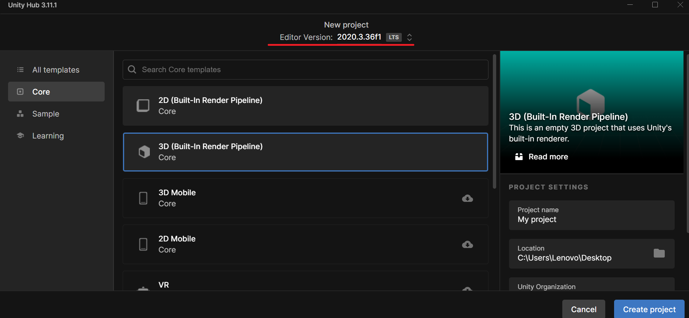
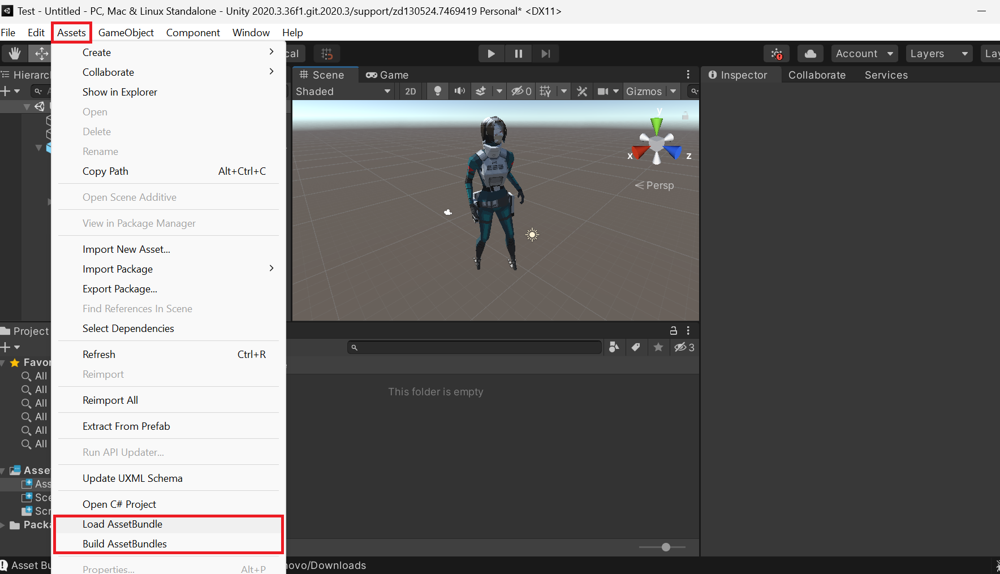
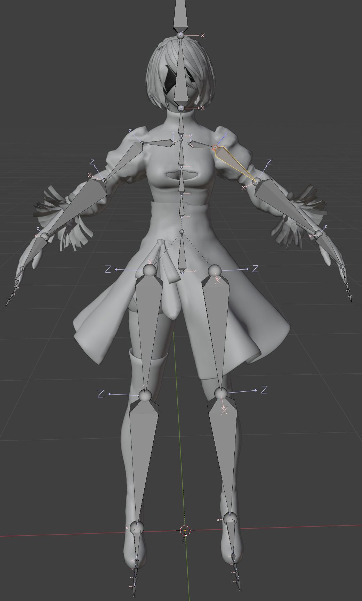
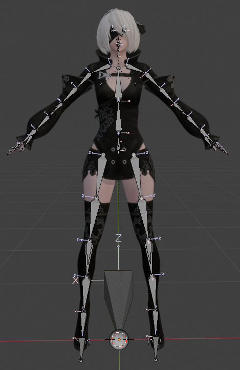
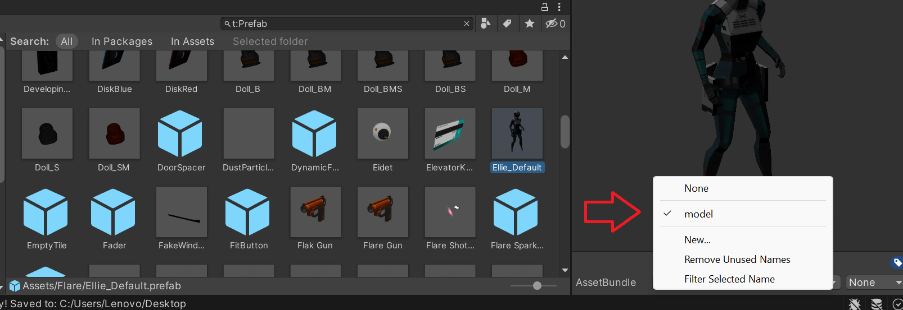
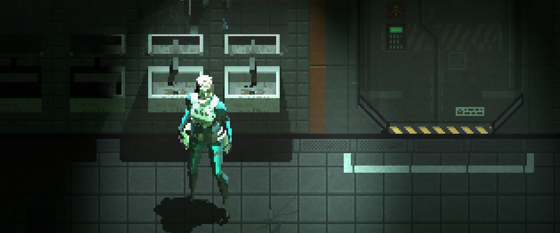

# ModelImport-Signalis[WIP]
Everything is currently WIP: scripts, mod, guide...

This mod allows importing custom models for player model into Signalis by loading AssetBundles.

## Future Plans(?)
For now, this mod only changes the player model.

This mod operates based on demand, so I list the following possibilities where I need to know if there is any interest:

- NPC models
- Weapon models
- Enemy models
- etc.

[Planned] v0.2.0-alpha: Height offset

## Mod requirement/ installment
Version 0.1.0-alpha is the first working release. Future versions may change requirements and introduce new features.

**Requirement:**
[**Melonloader v0.5.7**](https://melonwiki.xyz/#/README?id=automated-installation)

**Where to put the file?**

- Open Steam 
- Right click Signalis
- Manage>Browse local Files
- After installing MelonLoader, place the contents of the zipped mod folder into the Signalis Mod folder.

**Placing AssetBundle Model:**

Inside the Mods folder, you will find a ModelImporter_data folder.
Place your AssetBundle files inside this folder to use them with the mod.

[Download v0.1.0-alpha](https://github.com/ZiegelsteinNBG/ModelImport-Signalis/releases/tag/v0.1.0-alpha)

## Model export guide as Unity AssetBundle
Please read this guide carefully. If you have any difficulties understanding specific steps, have suggestions for improvement, need any help or found some errors, feel free to post an issue on GitHub or contact me on Discord (user: ziegelstein).

This guide provides information on the requirements your model must meet and how to export it from Unity as an AssetBundle. However, the process of importing your model from Blender and rigging it in the Unity Editor is up to you.
Please do me a favor and title your mod with the prefix "MI-" so it's visible that it's a customization mod (this will help make it clear to possible future mods ;)) when you publish it on NexusMods.

Please note that the requirements and instructions may change in the future.

#### Requirements:
- [Unity Hub](https://docs.unity3d.com/hub/manual/InstallHub.html)
- [Required Version of Unity 2020.3.36](https://unity.com/releases/editor/whats-new/2020.3.36#release-notes)
- [AssetBundleBuilder Script](https://github.com/ZiegelsteinNBG/ModelImport-Signalis/tree/main/AssetBundle%20Scripts)
- Import the [AssetBundleExample](https://github.com/ZiegelsteinNBG/ModelImport-Signalis/tree/main/AssetBundleExample) into your Unity project via the [AssetBundleLoader](https://github.com/ZiegelsteinNBG/ModelImport-Signalis/tree/main/AssetBundle%20Scripts) script to understand the correct structure and setup.
- Your AssetBundle must contain both your model and the metarig. The metarig and bones should be named exactly as in the [example AssetBundle](https://github.com/ZiegelsteinNBG/ModelImport-Signalis/tree/main/AssetBundleExample) and must have the same hierachy to ensure compatibility.
  
### 1. Download and Install Unity Hub & Unity
Download and install [Unity Hub](https://docs.unity3d.com/hub/manual/InstallHub.html)

Ensure you have the correct [Unity Version 2020.3.36](https://unity.com/releases/editor/whats-new/2020.3.36#release-notes) installed. 

### 2. Create a New Unity Project
Open Unity Hub and create a new 3D Core project. (Projects > New Project > Core > 3D(Built-In Render Pipeline), make here sure to chose the correct Unity Editor 2020.3.36)

  

### 3. Import the AssetBundle Scripts
Import the script into Unity by placing it inside your Assets/Scripts/ folder. (Create the Scripts folder)

Drag the scripts into the Scripts folder.

### 4. Import the AssetBundleExample Model
Download the AssetBundleExample and go to Assets > Load AssetBundle in Unity. Select the example AssetBundle file.

If everything is set up correctly, the example model should appear in the scene.

  

### 5.1 Prepare your model in blender
It is important to have the bone orientation and the export if the model to be correct. Compare the bone orientations and rotate them correctly in the editor. If you are finished, export the fbx with primary bones +x, secondary bones -y.

  
  

### 5.2 Import Your Model
Drag your .fbx or .obj model into the Assets folder.

Make sure the model has the correct rig and bone structure. Additional parts should be on the same layer as the body or parented to the appropriate bones.

It’s important that the skeleton is named "metarig" as shown in the example. Every bone you want to animate, similar to the ones in the game, should be named exactly as in the example. Missing bones or additional bones will not be animated.

To check if you have the bone orientations correct, you can import the example model and copy and paste each rotation of the bones to your model and you will get a similar pose if the bone orientations are correct. 

### 6. Prepare the Model for Export
Before exporting, make sure to add your prefab to an AssetBundle. Click on your prefab and find the bar at the bottom right named AssetBundles, where the model inspector is located. (As shown in the picture below.)

In the current version of the mod, you must name it model. In the future, you will be able to name it whatever you like if the mod supports multiple imports.

  

To build the AssetBundles, go to Assets > Build AssetBundles. Ignore the AssetBundle named after your directory—this is Unity's internal process.

### 7. Testing the AssetBundle
You can test it by creating a new Unity project and importing the AssetBundle with the script.

Alternatively, and more importantly, you can test it by placing the AssetBundle in the ModelImporter_data folder and testing the mod.

  

